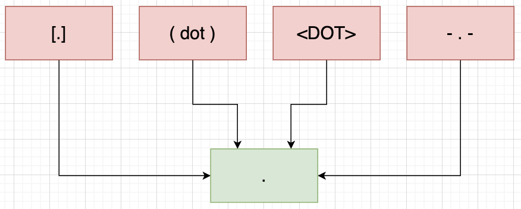

# Name & Email Address Entity Extraction

For my CS 410 Fall 2023 final project, I have chosen Theme 3: System Extension in the CS 410 Project Topics guide. I have augmented the ExpertSearch System by improving the methodology for converting the unstructured text in faculty webpages into more structured text to enhance the utility of the system. For this project, I have created a system for automatically extracting names and email addresses from text files of faculty biographies generated by ExpertSearch. Read on for more information about ExpertSearch, my entity extraction methodology, performance comparisons, how to navigate this repository, and how to test my work. 

Overall, my entity extraction system performs better than the old system according to both quantitative and qualitative metrics.

### About ExpertSearch

[Copied from CS 410 Projects Topic guide] The [ExpertSearch system](http://timan102.cs.illinois.edu/expertsearch//) was developed by some previous CS410 students as part of their course project! The system aims to find faculty specializing in the given research areas. The underlying data and ranker currently comes from the MP2 submissions of the previous course offering. 
- Extracting relevant information from faculty bios: 

    The problem here is to convert the unstructured text in faculty webpages into more structured text. Such structured information would enhance the utility of the system. For example, in the ExpertSearch system, emails and faculty names extracted from bios are shown in the search results. Users can click on the “mail” button to directly mail the faculty. Extraction is done using regex-based techniques and Named Entity Recognition (NER) that don’t always work well. *Can you improve those existing techniques?*

YES! See below for more!


## About My Entity Extraction Methodology
The previous ExpertSearch system did not appear to implement any data cleaning on the raw faculty bio text files. Upon manual inspection of these text files, there are many writing inconsistencies, particularly regarding placement and usage of special characters. Before performing any extractions, my program runs two sets of data cleaning procedures on the faculty bio text files: one designed to improve name extraction and one designed to improve email address extraction. Data cleaning is especially important because many faculty members try to disguise their email address to avoid spam by using variations of the "." and "@" symbols (see pictures below). More documentation on this data cleaning is available in the docstrings and code comments.

### Cleaning Up "@" variations


### Cleaning Up "." variations


### Extracting Faculty Names
The previous ExpertSearch system uses Named Entity Recognition (NER) to extract faculty names from the biographies. I also used NER for extracting faculty names, but I used a different model. I used Flair's ner-large model which, according to Flair, is their "best 4-class model [...] trained using a very large transformer. Use it if accuracy is the most important to you, and speed/memory not so much." I decided to use this model because improved accuracy was my main goal, and this model works on most languages according to Flair. The multi-language applicability is important since these faculty bios are from universities all over the world. While all bios have been translated to English, the faculty names are still representative of names from many languages. For more information about Flair's NER methods and models, [click here](https://flairnlp.github.io/docs/tutorial-basics/tagging-entities).

Since this model does take quite a bit of time to predict the entity type for each token in a sentence sequence, I used the following assumptions to speed up the process. 
- Each bio is for a single faculty member. $\rightarrow$ My program will return the first name found in a bio. Once this first name has been found, no further name extraction is performed on the bio. 
- Faculty names will most likely appear in the first 20 words of their bio. $\rightarrow$ My program will assess the faculty bios in sequential 20-word intervals with 5-word overlaps between intervals until the first name has been found.

### Extracting Faculty Email Addresses

Most automated extraction of email addresses in text, including the previous implementation of ExpertSearch, uses regular expressions (regex) based-techniques that rely on rules about where the "@" symbol occurs, allowable characters in recipient names (before the "@"), and allowable characters in domain names (after the "@"). For more information about what makes an email address valid or invalid, [click here](https://knowledge.validity.com/hc/en-us/articles/220560587-What-are-the-rules-for-email-address-syntax-).

I took a different approach - I first create a list of all valid top-level domain names. Then, I split the faculty bio text on all whitespace characters, creating a list of tokens (words) in the bio. The email address recognition then happens by finding the first instance where a token ends in a valid top-level domain name, and then it uses a series of conditionals to determine if some combination of the token and its two prior tokens form an email address. In these conditionals, rules about the placement of the "@" symbol are used, but the "@" symbol is no longer the primary tool for identifying email addresses. 

These conditionals avoid mistakenly extracting URLs in place of email addresses (top-level domains are the same for URLs and email addresses). They also allow for flexibility in spacing in how the faculty member wrote their email address in their bio, since some faculty members use variations of spacing to disguise their email addresses to avoid spam. 

As mentioned above, many faculty members attempt to hide their emails from spam by using variations in spacing and special characters. The following are examples of the original text string in the faculty bio compared with the email address that my program extracted. I also include a column for the results from the previous ExpertSearch extraction results (no entry indicates it did not identify and extract an email address).

| Faculty Bio ID | Original String | Extracted Email Address | Previous ExpertSearch Extraction |
| ------------------| -------------|-------------|-----|
| 5425 | ppatras [at] inf.ed.ac.uk | ppatras@inf.ed.ac.uk | |
| 53 | lavalle uiuc.edu | lavalle@uiuc.edu | |
 1653 | asood (at) gmu (dot) edu | asood@gmu.edu | |
| 1033 | Yun.Fu (at) cs.ucl.ac.uk  | yun.fu@cs.ucl.ac.uk | |
| 3219 | yap(at)cs(dot)nyu(dot)edu | yap@cs.nyu.edu | |
| 1611 | pammann@gmu.edu | pammann@gmu.edu | pammann@gmu.edu|

Often, some form of the person's name is included in the recipient name of the email address. One of the conditionals utilizes the faculty name extracted from the bio to assist the email address extraction process. For example, if I wrote my email as "otte illinois.edu" in a bio, regex-based methods utilizing "@" symbol rules would not work because no "@" symbol exists. However, my program can recognize this string as an email! It splits on the space and sees the current token as "illinois.edu" and its previous token as "otte". It knows that the name associated with this bio is "Anna K. Otte", so it compares the previous token with the already extracted name and realizes that since the previous token is in the name string, the previous token together with the current token refer to an email address: "otte@illinois.edu". This method of combining name extraction results with the email extraction attempt was the reason behind my success on faculty bio with ID = 53, as seen in the above table.

Future work could include creating a similarity metric to compare the extracted name with the previous token to allow for more flexibility in how a person's name is written in the recipient name portion of the email address. Examples: akotte, otte7, etc. 

More documentation on the conditionals used to extract email addresses is available in the docstrings and code comments.

## Performance 
By manually annotating the presence of names and email addresses of 100 randomly selected faculty biographies, I was able to calculate accuracy, precision, and recall. Only 100 randomly selected faculty biographies were evaluated due to my time constraints. However, the random selection with seed=0 ensures that no manipulation to make the results "look good" occured and that a variety of faculty biographies (e.g., from many different universities across a range of countries) was evaluated.

Compared with the previous implementation of entity extraction for ExpertSearch, this new entity extraction methodology achieves an **improvement of 5% accuracy for names and 13% accuracy for email addresses.**

### Results: Name Extraction

| Evaluation Metric | Old System | New System | 
| ------------------| -------------|-------------|
| Accuracy | 0.920 | 0.970 |
| Precision | 1.000 | 1.000 |
| Recall | 0.916 | 0.968 |

### Results: Email Address Extraction

| Evaluation Metric | Old System | New System | 
| ------------------| -------------|-------------|
| Accuracy | 0.800 | 0.930 |
| Precision | 1.000 |  0.983 |
| Recall | 0.688 | 0.906 |


### Quality Evaluation

Of course, the presence of an extracted name or email address does not indicate the quality or utility of that entity. For example, even if an email address was extracted, that does not mean it is a valid email address capable of contacting the faculty member. Therefore, name and email datasets were also evaluated using author-designed quality metrics in OpenRefine. My OpenRefine operation history is available in email_quality_openrefine_history.json. The tables below give a description of each quality metric I created along with the number of violations in my results and in the previous ExpertSearch entity extraction results. Lower numbers mean higher quality.

#### Email Address Quality
| Quality Metric Description | Old System | New System | 
| ------------------| -------------|-------------|
| Recipient Name Starts w/ Special Character | 0 | 3 |
| Recipient Name Ends w/ Special Character | 6 |  8 |
| Domain Name Contains Special Character | 3 | 3 |
| Domain Name Starts w/ Special Character | 1 | 4 |
| Domain Name Ends w/ Special Character | 2 | 0 |
| Domain Name does not Contain "." | 127 | 0 |
| Email does not Contain "@" | 0 | 0 |

As seen above, my new system suffers from a couple extra quality violations for a few metrics, but **I also extracted 561 more email addresses than the old system**, so these couple extra errors are expected. Also, the old system extracts a lot (127) of email addresses without a "." in the domain name, invalidating these emails, while my system always contains a "." in the domain name.

**Overall, my entity extraction system performs better than the old system according to both quantitative and qualitative metrics.**

## Project Limitations
While I initially proposed to implement entity extraction for additional entities as part of this project, I am working by myself on this project and already exceeded the instructor-suggested 20 hour time commitment by 20-30 hours (e.g., I have spent 40-50 hours total). Therefore, I refined the scope of my project to focus only on implementing and evaluating name and email address extraction.

## Contents

All python files use google-type docstrings and were formatted using [Black](https://pypi.org/project/black/).

### File Structure 
```
├── email_quality_openrefine_history.json
├── improved_expert_search_entity_extraction/
│   ├── data/
│   │   ├── compiled_bios/
│   │   └── previous_version_extraction_results/
│   ├── extract_entities.py
│   ├── generate_human_labels.py
│   ├── peer_review_test.py
│   ├── requirements.txt
│   ├── results/
│   │   ├── NEW_emails.txt
│   │   └── NEW_names.txt
│   ├── subset_results/
│   │   ├── NEW_emails.txt
│   │   └── NEW_names.txt
│   ├── test_extraction.py
│   ├── test_results/
│   │   ├── author_generated_labels.csv
│   │   ├── NEW_emails.txt
│   │   ├── NEW_names.txt
│   │   └── user_generated_labels.csv
│   └── top_level_domains.txt
├── progress_report.pdf
├── project_proposal.pdf
└── Readme.md
```

#### Top-Level Directory Explanation
| File/Folder Name | Description | 
| ------------------| -------------|
| email_quality_openrefine_history.json | OpenRefine operation history for email address qualitative evaluation |
| improved_expert_search_entity_extraction | All code, inputs, and outputs |
| progress_report.pdf | Progress report | 
| project_proposal.pdf | Project proposal | 
| Readme.md | Repository readme | 

```
├── improved_expert_search_entity_extraction/
│   ├── extract_entities.py
│   ├── generate_human_labels.py
│   ├── peer_review_test.py
│   ├── requirements.txt
│   ├── test_extraction.py
│   └── top_level_domains.txt
```
| File/Folder Name | Description | 
| ------------------| -------------|
| extract_entities.py | Entity extraction program for all of or portion of faculty bios using new method |
| generate_human_labels.py | Iterates through randomly selected portion of faculty bios prompting user to evaluate presence/absence of names and emails | 
| peer_review_test.py | An easy file for peer-reviewers in CS 410 to run to test all classes and functions of new method | 
| requirements.txt | All python packages necessary to run this program | 
| test_extraction.py | Compares new and old methods using accuracy, precision, and recall for 100 randomly selected faculty bios using seed=0 |
| top_level_domains.txt | All valid top-level domain names as of 12/01/23 | 


```
├── improved_expert_search_entity_extraction/
│   ├── data/
│   │   ├── compiled_bios/
│   │   └── previous_version_extraction_results/
```
| File/Folder Name | Description | 
| ------------------| -------------|
| data | Data and results from previous ExpertSearch |
| compiled_bios | All 6,525 faculty bio text files | 
| previous_version_extraction_results | Results of each entity type extracted using previous version of ExpertSearch stored in text files | 

```
├── improved_expert_search_entity_extraction/
│   ├── results/
│   │   ├── NEW_emails.txt
│   │   └── NEW_names.txt
```
| File/Folder Name | Description | 
| ------------------| -------------|
| results | Entity extraction results using new method |
| NEW_emails.txt | Emails extracted for all 6,525 faculty bios using new entity extraction method | 
| NEW_names.txt | Names extracted for all 6,525 faculty bios using new entity extraction method | 

When the perform_extractions() method of the ExtractBioEntities class in extract_entities.py is run with default arguments, results will be available in the directory above.

```
├── improved_expert_search_entity_extraction/
│   ├── subset_results/
│   │   ├── NEW_emails.txt
│   │   └── NEW_names.txt
```
| File/Folder Name | Description | 
| ------------------| -------------|
| subset_results | Entity extraction results for portion of faculty bios using new method |
| NEW_emails.txt | Emails extracted for portion of faculty bios using new entity extraction method | 
| NEW_names.txt | Names extracted for portion of faculty bios using new entity extraction method | 

When the perform_extractions() method of the ExtractBioEntities class in extract_entities.py is run with a positive integer as the value for the run_subset argument, results will be available in the directory above.
```
├── improved_expert_search_entity_extraction/
│   ├── test_results/
│   │   ├── author_generated_labels.csv
│   │   ├── NEW_emails.txt
│   │   ├── NEW_names.txt
│   │   └── user_generated_labels.csv
```
| File/Folder Name | Description | 
| ------------------| -------------|
| test_results | Entity extraction results for 100 faculty bios randomly selected with seed=0 and using new method |
| author_generated_labels.csv | Presence/absence of names and emails in 100 randomly selected faculty bios with seed=0; manually labeled by author | 
| NEW_emails.txt | Emails extracted for 100 randomly selected faculty bios with seed=0 and using new extraction method | 
| NEW_names.txt | Names extracted for 100 randomly selected faculty bios with seed=0 and using new extraction method | 
| user_generated_labels.csv | Presence/absence of names and emails in subset of faculty bios; manually labeled by user  | 

When the get_human_generated_labels() function in generate_human_labels.py is run, or when the test_extraction_performance() method of the TestEntityExtraction class in test_extraction.py is run, results will be available in the directory above.  

## Usage - Running the Code

### Setup

Requires Python 3.7.6 or later.

 To install dependencies, run:

 `pip install -r requirements.txt` 

### Run Peer Reviewer Test to Demo Capabilities
To demo this program, the peer_review_test.py will walk users through three functionalities. Each functionality demonstration will take about 2-3 minutes. Note - if you have never used Flair on your device before, the first demo may download and install additional packages, taking an extra ~2 minutes. 

Type the following commands to begin:

`cd improved_expert_search_entity_extraction`

`python peer_review_test.py`

You should see the following statement appear soon: 
```
Test New Faculty Bio Entity Extraction Methodology: Begin Run
```
The Flair ner-large model will then begin loading, and that will take possibly 1-2 minutes or 3-4 minutes if you have never run Flair before (see above). Don't worry if nothing appears for a bit. Once the model finishes loading, you will see something similar to the following statement appear.
```
2023-12-09 11:37:39,418 SequenceTagger predicts: Dictionary with 20 tags: <unk>, O, S-ORG, S-MISC, B-PER, E-PER, S-LOC, B-ORG, E-ORG, I-PER, S-PER, B-MISC, I-MISC, E-MISC, I-ORG, B-LOC, E-LOC, I-LOC, <START>, <STOP>
```
 The next statement will appear over and over until all 100 randomly selected bios that were manually labeled by me have run and compared to the previous ExpertSearch using accuracy, precision, and recall. [i] will equal the ID number of the bio that has just begun processing. The [i]'s will not be sequential since they were randomly selected.
```
Faculty Bio ID: [i]
```
Then, the following statements will appear. [x] equals the amount of time in minutes (usually 2-3) that the program took to run the test. The last statement will be followed by a dictionary of the accuracy, precision, and recall measures, and these values should match the tables in the Performance section above. 
```
Entity extraction runtime: [x]
Test New Faculty Bio Entity Extraction Methodology: End Run
Entity Extraction Metrics Comparison for Old & New Methodologies: 
```
The names and emails from this run are available in following directory:
```
├── improved_expert_search_entity_extraction/
│   ├── test_results/
│   │   ├── NEW_emails.txt
│   │   ├── NEW_names.txt
```
Next, the extraction process will be run on 50 randomly selected faculty bios with seed=1, this time to demonstrate the program's ability to run just a subset of the faculty bios with any random seed. You will see the following statement, again followed by a pause while the Flair ner-large model loads, and then the Flair model statement again.
```
Entity Extraction on 50 Random Faculty Bios: Begin Run
```
The program will again print the numerical ID of the faculty bio it is currently working on until it reaches 50 total IDs. Once it is finished running, you will see these statements (where again, [x] equals time) followed by lists of names and email addresses extracted.
```
Entity extraction runtime:  [x]
Entity Extraction on 50 Random Faculty Bios: End Run
```
The results from this run, i.e., the text files with the extracted names and email addresses, will be available in the following directory:
```
├── improved_expert_search_entity_extraction/
│   ├── subset_results/
│   │   ├── NEW_emails.txt
│   │   └── NEW_names.txt
```
The final functionality to demonstrate is the ability to guide users through a relatively painless manual evaluation (as compared to MP3.1, for example) of the presence/absence of names and email addresses in the faculty bios. This is the function that I used when manually labeling 100 randomly selected faculty bios to evaluate my entity extraction methodology against the previous ExpertSearch entity extraction methodology.  I have adjusted the parameters in this file to only make the peer reviewer evaluate 3 short faculty bios (rather than the 100 that I did) to reduce peer-reviewer time but still show this capability. You will see the following statement followed by the text of the first faculty bio. 
```
Demo: User Manual Evaluation on 3 Faculty Bios
```
The faculty bio text will be followed by these two prompts, to which you should read the bio and answer either 1 (yes) or 0 (no).
```
Does bio have a name? If yes, type 1 then press enter. Else, type 0 then press enter.
Does bio have a email? If yes, type 1 then press enter. Else, type 0 then press enter.
```
Once you have evaluated all three faculty bios, the following statement will appear.
```
Demo Ended. You can view your output in test_results/user_generated_labels.csv
```
This statement indicates that you can find your results in the following directory.
```
├── improved_expert_search_entity_extraction/
│   ├── test_results/
│   │   └── user_generated_labels.csv
```
If you don't want to read through the 3 faculty bios during this last capability demonstration, here are the answers:
- First bio
    - Name: 0
    - Email: 1
- Second bio
    - Name: 1
    - Email: 1
- Third bio
    - Name: 1
    - Email: 1

Since the entity extraction on all 6,525 faculty bios takes 2.5-5.5 hours to run (depending on operating system, other programs running, etc.), I am using the above demos to show peer-reviewers that my methodology works without taking hours of their time. For confirmation that the full program runs, see my video.

## Miscellaneous
### Author
This repository was created by Anna Otte in Fall 2023 for her final project in CS 410 Text Information Systems at University of Illinois Urbana Champaign. 

### License
All code in this repository is open source and available for others to use. 

### Future Use
While it was designed with ExpertSearch faculty biographies in mind, with some edits to the input filepaths and data, the name and email address extraction (ExtractBioEntities class within extract_entities.py) should work with any series of text files. I welcome any attempts to extrapolate this name and email address entity extraction process to other use cases.